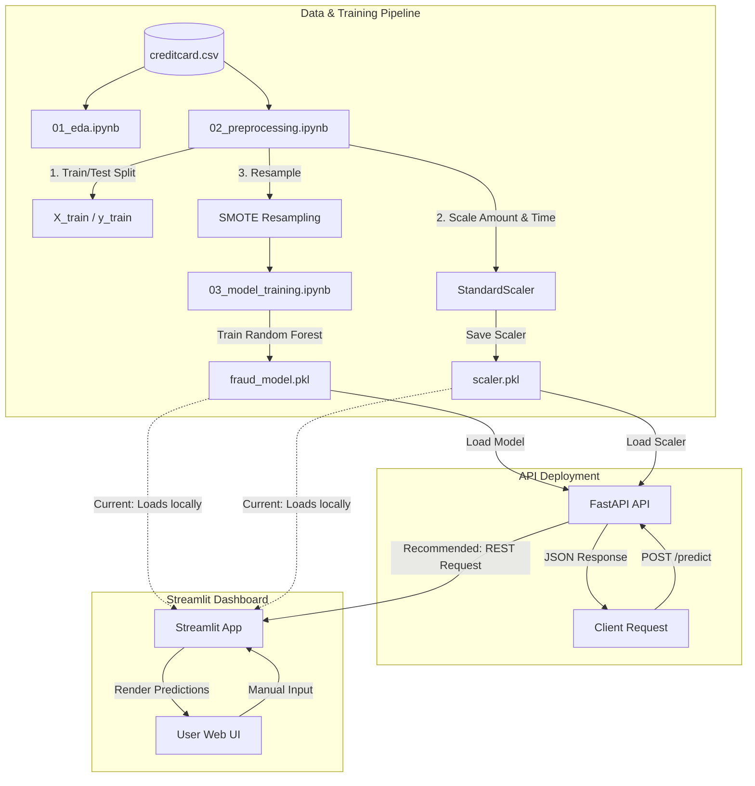

# 🛡️ ScamShield Repository Architecture & Deep-Dive Analysis

This document provides a comprehensive technical review of the **ScamShield** real-time fraud detection codebase. It outlines the current system architecture, highlights critical bugs and security vulnerabilities, addresses documentation mismatches, and details a clear refactoring plan to bring the repository to production-grade quality.

---

## 1. 📌 Executive Summary

ScamShield is designed as an end-to-end Machine Learning system for real-time fraud detection. It consists of:
1. **An ML Pipeline** in Jupyter Notebooks using standard preprocessing, scaling, and SMOTE resampling to train a Random Forest Classifier.
2. **A FastAPI REST API** that loads the trained model and scaler to serve real-time predictions.
3. **A Streamlit Dashboard** providing a web interface for manual transaction checks.

While the project has a clean folder structure and clear objectives, this analysis has identified a **critical data corruption bug** where features are misaligned during scaling at inference, **architectural duplication** where the dashboard bypasses the API, and **security vulnerabilities** in serialization.

---

## 2. 🏗️ High-Level System Architecture

The following diagram illustrates the workflow of data from training to deployment, highlighting how the components interact:



---

## 3. 🚨 Critical Bugs & Vulnerabilities

### 1. Column Ordering Swap in Scaler Transform (Critical Bug)
The pre-trained `StandardScaler` was fitted on training columns ordered as `['Amount', 'Time']`, but inference code in `api/main.py` and `dashboard/app.py` passes columns ordered as `['Time', 'Amount']`. This corrupts both features before passing them to the Random Forest model.

#### The Code Mismatch
*   **In Training (`02_preprocessing.ipynb` & `03_model_training.ipynb`):**
    ```python
    X_train[['Amount','Time']] = scaler.fit_transform(X_train[['Amount','Time']])
    ```
    This fits the scaler on a DataFrame slice where **Column 0 is `Amount`** and **Column 1 is `Time`**.
*   **In Inference (`api/main.py` & `dashboard/app.py`):**
    ```python
    # values[:, 0] is Time, values[:, -1] is Amount
    values[:, [0, -1]] = scaler.transform(values[:, [0, -1]])
    ```
    This slices the numpy array to pass a 2D matrix where **Column 0 is `Time`** and **Column 1 is `Amount`** into the scaler.

#### Mathematical Impact
Inspecting the serialized `scaler.pkl` reveals the following fitted attributes:
*   **Scaler Mean:** `[8.81762977e+01, 9.48850937e+04]` (Index 0 = `Amount` Mean, Index 1 = `Time` Mean)
*   **Scaler StdDev:** `[250.72205134, 47488.31082158]` (Index 0 = `Amount` Scale, Index 1 = `Time` Scale)

When a transaction is sent with `Time = 10000.0` and `Amount = 100.0`:
| Feature | Intended Formula & Value | Actual Erroneous Formula & Value |
| :--- | :--- | :--- |
| **Time** | $\frac{10000.0 - 94885.09}{47488.31} = \mathbf{-1.78}$ | $\frac{10000.0 - 88.17}{250.72} = \mathbf{+39.53}$ |
| **Amount** | $\frac{100.0 - 88.17}{250.72} = \mathbf{+0.047}$ | $\frac{100.0 - 94885.09}{47488.31} = \mathbf{-1.99}$ |

Because `Time` and `Amount` are scaled using each other's parameters, the features fed into the Random Forest are garbage values far outside the trained distributions, completely invalidating fraud risk scores.

---

### 2. Fragile Inference Data Parsing (High Risk)
The API parses input dictionaries using `.values()` directly, assuming dictionary keys are ordered exactly as `Time`, `V1`...`V28`, `Amount`.
```python
values = np.array(list(data.values())).reshape(1, -1)
```
*   **Impact:** If a client submits a JSON payload with reordered keys (e.g., alphabetical ordering or putting `Amount` at the top), the data is mapped to wrong columns. Additionally, missing or extra keys cause the backend to crash with a model shape mismatch.

---

### 3. Insecure Model Loading via Pickle (Security Vulnerability)
Loading serialized models via `joblib.load()` on `.pkl` files is vulnerable to **arbitrary code execution** (RCE).
```python
model = joblib.load("models/fraud_model.pkl")
```
*   **Impact:** If an attacker modifies the `.pkl` files on disk, or if model updates are downloaded over insecure connections, loading them can execute malicious payloads with the permissions of the web server.

---

## 4. 📉 Mismatches & Technical Debt

### 1. Architectural Duplication
The Streamlit dashboard loads its own copy of the Random Forest model and Scaler locally:
```python
model = joblib.load("models/fraud_model.pkl")
scaler = joblib.load("models/scaler.pkl")
```
This bypasses the FastAPI server. In a production setting, the dashboard should act as a lightweight client sending HTTP requests to the FastAPI backend. Loading the model locally consumes unnecessary memory and makes deploying changes (e.g., upgrading to a larger XGBoost model) difficult because the model files must be bundled into both host servers.

### 2. Discrepancies Between Code and Documentation

*   **Risk Level Thresholds:**
    *   **README:** Table indicates Low (0.0-0.3), Medium (0.3-0.7), and High (0.7-1.0).
    *   **FastAPI Code:** Implements thresholds at Low ($\le 0.2$), Medium ($0.2 < \text{prob} \le 0.4$), and High ($&gt; 0.4$).
*   **API Response Payload:**
    *   **README:** Documented response includes `prediction` (0/1) and `timestamp` keys.
    *   **FastAPI Code:** Only returns `fraud_probability` and `risk_level`.

### 3. Incomplete Jupyter Notebooks
*   `01_eda.ipynb` contains only a single cell with almost all exploratory code and plots commented out.
*   `02_preprocessing.ipynb` lacks robust checking and uses hardcoded paths.

---

## 5. 🎨 Dashboard & UI/UX Analysis

The current dashboard creates **30 sequential vertical input fields** using a simple `for` loop:
```python
for i in range(1, 29):
    val = st.number_input(f"V{i}", value=0.0)
```
*   **The Problem:** Rendering a vertical list of 28 anonymized PCA features (`V1` to `V28`) results in a poor user experience, requiring the user to scroll endlessly.
*   **Recommended Improvements:**
    1.  **Grid Layout:** Organize inputs into dynamic columns using `st.columns` (e.g., 4 columns of 7 fields each).
    2.  **Preset Samples:** Add "Quick Fill" templates (e.g., "Load Sample Fraud Transaction" or "Load Sample Normal Transaction") to instantly populate the form.
    3.  **File Upload:** Implement a CSV drop zone allowing users to upload and evaluate transactions in batch.

---

## 6. 🛠️ Actionable Refactoring Plan

### Step 1: Fix the Preprocessing Notebook (Correct Scaling fit)
In `02_preprocessing.ipynb` and `03_model_training.ipynb`, change the column order during fitting:
```python
# Change from: X_train[['Amount','Time']]
# Change to:
X_train[['Time', 'Amount']] = scaler.fit_transform(X_train[['Time', 'Amount']])
X_test[['Time', 'Amount']] = scaler.transform(X_test[['Time', 'Amount']])
```
This aligns the fit order to `[Time, Amount]`, matching the index positions `[0, -1]` in the full features array.

### Step 2: Implement Pydantic Schema and Fix API
Update `api/main.py` to enforce a strict request model, map inputs safely by name, and correct the scaling bug.

```python
from fastapi import FastAPI, HTTPException
from pydantic import BaseModel, Field
import joblib
import numpy as np
from datetime import datetime

app = FastAPI(
    title="ScamShield Fraud Detection API",
    description="Real-time REST API for predicting transaction fraud risk level.",
    version="1.0.0"
)

# Load resources
try:
    model = joblib.load("models/fraud_model.pkl")
    scaler = joblib.load("models/scaler.pkl")
except Exception as e:
    raise RuntimeError(f"Error loading model artifacts: {str(e)}")

# Pydantic Schema for explicit types and key ordering validation
class TransactionInput(BaseModel):
    Time: float = Field(..., description="Seconds elapsed since the first transaction", example=10000.0)
    V1: float = Field(0.0, example=0.0)
    V2: float = Field(0.0, example=0.0)
    V3: float = Field(0.0, example=0.0)
    V4: float = Field(0.0, example=0.0)
    V5: float = Field(0.0, example=0.0)
    V6: float = Field(0.0, example=0.0)
    V7: float = Field(0.0, example=0.0)
    V8: float = Field(0.0, example=0.0)
    V9: float = Field(0.0, example=0.0)
    V10: float = Field(0.0, example=0.0)
    V11: float = Field(0.0, example=0.0)
    V12: float = Field(0.0, example=0.0)
    V13: float = Field(0.0, example=0.0)
    V14: float = Field(0.0, example=0.0)
    V15: float = Field(0.0, example=0.0)
    V16: float = Field(0.0, example=0.0)
    V17: float = Field(0.0, example=0.0)
    V18: float = Field(0.0, example=0.0)
    V19: float = Field(0.0, example=0.0)
    V20: float = Field(0.0, example=0.0)
    V21: float = Field(0.0, example=0.0)
    V22: float = Field(0.0, example=0.0)
    V23: float = Field(0.0, example=0.0)
    V24: float = Field(0.0, example=0.0)
    V25: float = Field(0.0, example=0.0)
    V26: float = Field(0.0, example=0.0)
    V27: float = Field(0.0, example=0.0)
    V28: float = Field(0.0, example=0.0)
    Amount: float = Field(..., description="Transaction value", example=100.0)

@app.get("/")
def home():
    return {"message": "ScamShield API running"}

@app.post("/predict")
def predict(tx: TransactionInput):
    # Construct feature list in the exact order the model expects
    feature_keys = ["Time"] + [f"V{i}" for i in range(1, 29)] + ["Amount"]
    tx_dict = tx.dict()
    
    # 1. Shape: (1, 30)
    feature_vector = np.array([tx_dict[k] for k in feature_keys]).reshape(1, -1)
    
    # 2. Scale Time and Amount
    # If the scaler was re-fitted on ['Time', 'Amount'] order:
    feature_vector[:, [0, -1]] = scaler.transform(feature_vector[:, [0, -1]])
    
    # Run prediction
    try:
        prob = model.predict_proba(feature_vector)[0][1]
    except Exception as e:
        raise HTTPException(status_code=500, detail=f"Inference failed: {str(e)}")
    
    # Define risk levels using README alignment or refined thresholds
    prediction = int(prob > 0.4) # Using 0.4 threshold
    if prob > 0.4:
        risk = "HIGH"
    elif prob > 0.2:
        risk = "MEDIUM"
    else:
        risk = "LOW"
        
    return {
        "fraud_probability": float(prob),
        "risk_level": risk,
        "prediction": prediction,
        "timestamp": datetime.utcnow().isoformat()
    }
```

### Step 3: Decouple the Dashboard and Improve UI
Refactor `dashboard/app.py` to route predictions through the API server, organize the input form into columns, and supply quick-fill examples.

```python
import streamlit as st
import requests
import json

st.set_page_config(
    page_title="ScamShield Dashboard",
    page_icon="🛡️",
    layout="wide"
)

st.title("🛡️ ScamShield Fraud Detection System")
st.write("Real-time fraud risk visualizer connected to the REST API container.")

API_URL = "http://127.0.0.1:8000/predict"

# Pre-populated templates for testing
NORMAL_TEMPLATE = {"Time": 500.0, "Amount": 45.0, **{f"V{i}": 0.01 * i for i in range(1, 29)}}
FRAUD_TEMPLATE = {
    "Time": 12000.0, "Amount": 850.0,
    "V3": -2.1, "V4": 3.4, "V7": -1.8, "V10": -4.2, "V11": 2.5, "V12": -5.1, "V14": -6.8, "V17": -8.2,
    **{f"V{i}": 0.0 for i in range(1, 29) if f"V{i}" not in ["V3", "V4", "V7", "V10", "V11", "V12", "V14", "V17"]}
}

st.sidebar.header("🎯 Fast Testing Templates")
if st.sidebar.button("Load Normal Transaction Template"):
    st.session_state["inputs"] = NORMAL_TEMPLATE
elif st.sidebar.button("Load Fraud Transaction Template"):
    st.session_state["inputs"] = FRAUD_TEMPLATE

# Initialize state if empty
if "inputs" not in st.session_state:
    st.session_state["inputs"] = {"Time": 10000.0, "Amount": 100.0, **{f"V{i}": 0.0 for i in range(1, 29)}}

# Form container
with st.form("transaction_form"):
    st.subheader("Transaction Metadata")
    col_meta1, col_meta2 = st.columns(2)
    with col_meta1:
        time_input = st.number_input("Transaction Time Offset (seconds)", value=float(st.session_state["inputs"]["Time"]))
    with col_meta2:
        amount_input = st.number_input("Transaction Amount ($)", value=float(st.session_state["inputs"]["Amount"]))

    st.subheader("Anonymized PCA Features (V1 - V28)")
    v_values = {}
    
    # 4 grid columns for V features
    v_cols = st.columns(4)
    for index in range(1, 29):
        col_selector = (index - 1) % 4
        with v_cols[col_selector]:
            key = f"V{index}"
            v_values[key] = st.number_input(key, value=float(st.session_state["inputs"].get(key, 0.0)))

    submit_button = st.form_submit_button("Submit Transaction for Analysis")

if submit_button:
    # Prepare API payload
    payload = {
        "Time": time_input,
        "Amount": amount_input,
        **v_values
    }

    try:
        response = requests.post(API_URL, json=payload, timeout=5)
        if response.status_code == 200:
            result = response.json()
            
            # Rendering outputs
            prob = result["fraud_probability"]
            risk = result["risk_level"]
            pred = result["prediction"]
            
            st.markdown("---")
            st.subheader("🔍 Analysis Results")
            
            col1, col2 = st.columns(2)
            col1.metric(label="Fraud Risk Score", value=f"{prob * 100:.2f}%")
            col2.metric(label="Risk Classification", value=risk)
            
            if risk == "HIGH":
                st.error("🚨 CRITICAL ALERT: High probability of fraud detected! Block transaction and flag account.")
            elif risk == "MEDIUM":
                st.warning("⚠️ WARNING: Suspicious activity signature. Require multi-factor verification.")
            else:
                st.success("✅ APPROVED: Low fraud signature. Process normally.")
        else:
            st.error(f"API Server Error: Received status code {response.status_code}. Response: {response.text}")
    except requests.exceptions.ConnectionError:
        st.error("🔌 Connection Failed: Could not connect to the API server. Ensure FastAPI is running on http://127.0.0.1:8000")
    except Exception as e:
        st.error(f"An unexpected error occurred: {str(e)}")
```
